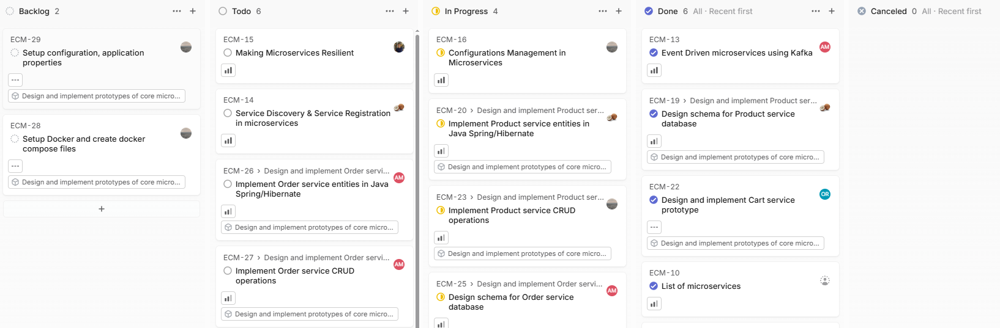

Po wejściu na stronę, główny widok wygląda następująco:

Kliknij w przycisk `All issues` po lewej stronie, następnie w przycisk `Display`, który znajduje się po prawej stronie i ustaw przedstawione wartości:

Tablica powinna już przypominać tę Jiro'wą i mieć podział na statusy zadań:

